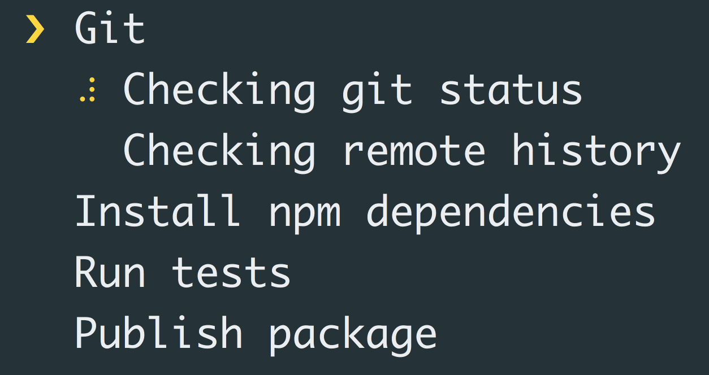

# listr [](https://travis-ci.org/SamVerschueren/listr)

> Terminal task list



## Install

```
$ npm install --save listr
```


## Usage

```js
const execa = require('execa');
const Listr = require('listr');

const tasks = new Listr([
	{
		message: 'Git',
		task: () => {
			return new Listr([
				{
					message: 'Checking git status',
					task: () => execa.stdout('git', ['status', '--porcelain']).then(result => {
						if (result !== '') {
							throw new Error('Unclean working tree. Commit or stash changes first.');
						}
					});
				},
				{
					message: 'Checking remote history',
					task: () => execa.stdout('git', ['rev-list', '--count', '--left-only', '@{u}...HEAD']).then(result => {
						if (result !== '0') {
							throw new Error('Remote history differ. Please pull changes.');
						}
					});
				}
			]);
		}
	},
	{
		message: 'Install package dependencies',
		task: () => execa('npm', ['install'])
	},
	{
		message: 'Run tests',
		task: () => execa('npm', ['test'])
	},
	{
		message: 'Publish package',
		task: () => execa('npm', ['publish'])
	}
]);

tasks.run().catch(err => {
	console.error(err);
});
```


## API

### Listr([tasks])

#### tasks

Type: `object[]`

List of tasks.

##### message

Type: `string`

Message of the task.

##### task

Type: `Function`

Task function.

### Instance

#### addTask(task)

Returns the instance.

##### task

Type: `object[]`

Task object.

#### run()

Start executing the tasks.


## Related

- [ora](https://github.com/sindresorhus/ora) - Elegant terminal spinner
- [cli-spinners](https://github.com/sindresorhus/cli-spinners) - Spinners for use in the terminal


## License

MIT © [Sam Verschueren](https://github.com/SamVerschueren)
