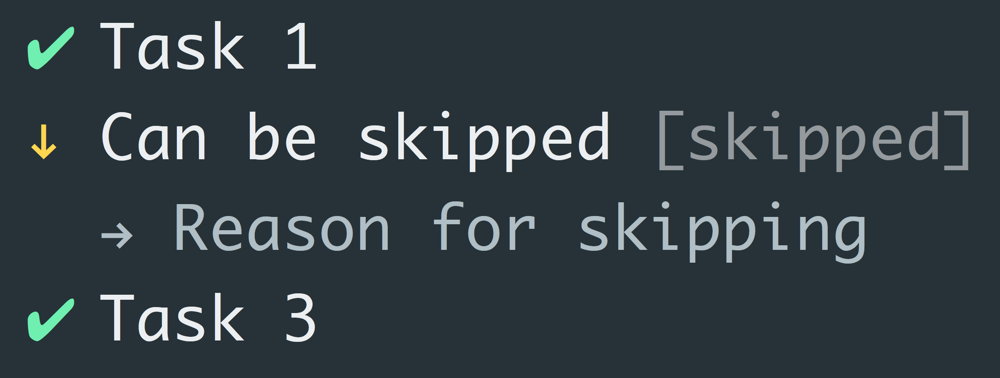

# listr [](https://travis-ci.org/SamVerschueren/listr)

> Terminal task list


## Install

```
$ npm install --save listr
```


## Usage

```js
const execa = require('execa');
const Listr = require('listr');

const tasks = new Listr([
	{
		title: 'Git',
		task: () => {
			return new Listr([
				{
					title: 'Checking git status',
					task: () => execa.stdout('git', ['status', '--porcelain']).then(result => {
						if (result !== '') {
							throw new Error('Unclean working tree. Commit or stash changes first.');
						}
					})
				},
				{
					title: 'Checking remote history',
					task: () => execa.stdout('git', ['rev-list', '--count', '--left-only', '@{u}...HEAD']).then(result => {
						if (result !== '0') {
							throw new Error('Remote history differ. Please pull changes.');
						}
					})
				}
			], {concurrent: true});
		}
	},
	{
		title: 'Install package dependencies',
		task: () => execa('npm', ['install'])
	},
	{
		title: 'Run tests',
		task: () => execa('npm', ['test'])
	},
	{
		title: 'Publish package',
		task: () => execa('npm', ['publish'])
	}
]);

tasks.run().catch(err => {
	console.error(err);
});
```


### Task

A `task` can return different values. If a `task` returns, it means the task was completed successfully. If a task throws an error, the task failed.

```js
const tasks = new Listr([
	{
		title: 'Success',
		task: () => 'Foo'
	},
	{
		title: 'Failure',
		task: () => {
			throw new Error('Bar')
		}
	}
]);
```


#### Promises

A `task` can also be async by returning a `Promise`. If the promise resolves, the task completed successfully, it it rejects, the task failed.

```js
const tasks = new Listr([
	{
		title: 'Success',
		task: () => Promise.resolve('Foo')
	},
	{
		title: 'Failure',
		task: () => Promise.reject('Bar')
	}
]);
```

#### Observable


A `task` can also return an `Observable`. The thing about observables is that it can emit multiple values and can be used to show the output of the
task. Please note that only the last line of the output is rendered.

```js
const tasks = new Listr([
	{
		title: 'Success',
		task: () => {
			return new Observable(observer => {
				observer.next('Foo');

				setTimeout(() => {
					observer.next('Bar');
				}, 2000);

				setTimeout(() => {
					observer.complete();
				}, 4000);
			});
		}
	},
	{
		title: 'Failure',
		task: () => Promise.reject(new Error('Bar'))
	}
]);
```

#### Streams

It's also possible to return a `stream`. The stream will be converted to an `Observable` and handled as such.


#### Skipping tasks



Optionally specify a `skip` function to determine whether a task can be skipped.

- If the `skip` function returns a truthy value or a `Promise` that resolves to a truthy value then the task will be skipped.
- If the returned value is a string it will be displayed as the reason for skipping the task.
- If the `skip` function returns a falsey value or a `Promise` that resolves to a falsey value then the task will be executed as normal.
- If the `skip` function throws or returns a `Promise` that rejects, the task (and the whole build) will fail.

```js
const tasks = new Listr([
	{
		title: 'Task 1',
		task: () => Promise.resolve('Foo')
	},
	{
		title: 'Can be skipped',
		skip: () => {
			if (Math.random() > 0.5) {
				return 'Reason for skipping';
			}
		},
		task: () => 'Bar'
	},
	{
		title: 'Task 3',
		task: () => Promise.resolve('Bar')
	}
]);
```


## API

### Listr([tasks], [options])

#### tasks

Type: `object[]`

List of tasks.

##### title

Type: `string`

Title of the task.

##### task

Type: `Function`

Task function.

##### skip

Type: `Function`

Skip function. Read more about [skipping tasks](#skipping-tasks).

#### options

##### showSubtasks

Type: `boolean`<br>
Default: `true`

Set to `false` if you want to disable the rendering of the subtasks. Subtasks will be rendered if
an error occurred in one of them.

##### concurrent

Type: `boolean`<br>
Default: `false`

Set to `true` if you want tasks to run concurrently.

### Instance

#### add(task)

Returns the instance.

##### task

Type: `object` `object[]`

Task object or multiple task objects.

#### run()

Start executing the tasks.


## Related

- [ora](https://github.com/sindresorhus/ora) - Elegant terminal spinner
- [cli-spinners](https://github.com/sindresorhus/cli-spinners) - Spinners for use in the terminal


## License

MIT © [Sam Verschueren](https://github.com/SamVerschueren)
